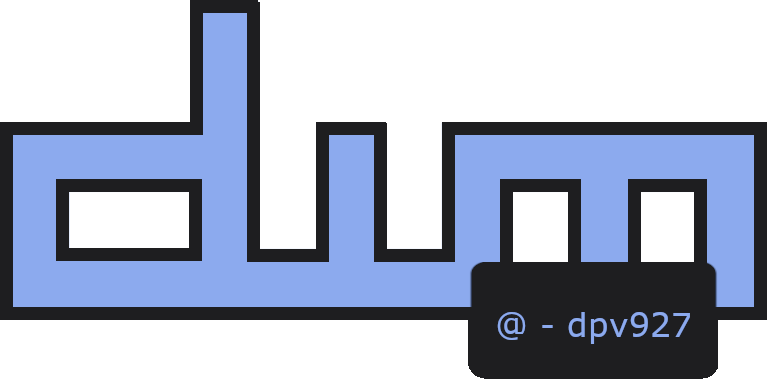
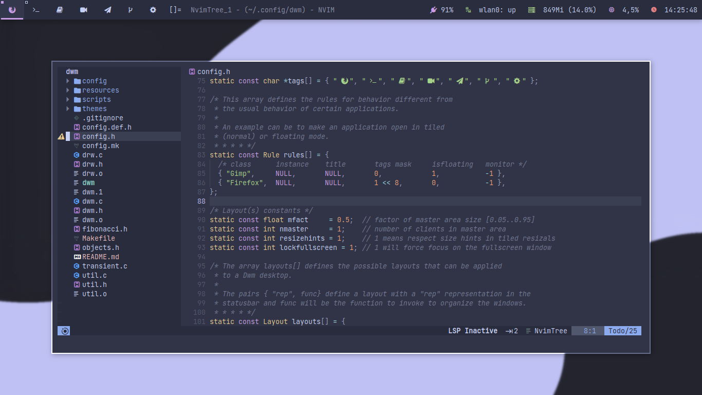
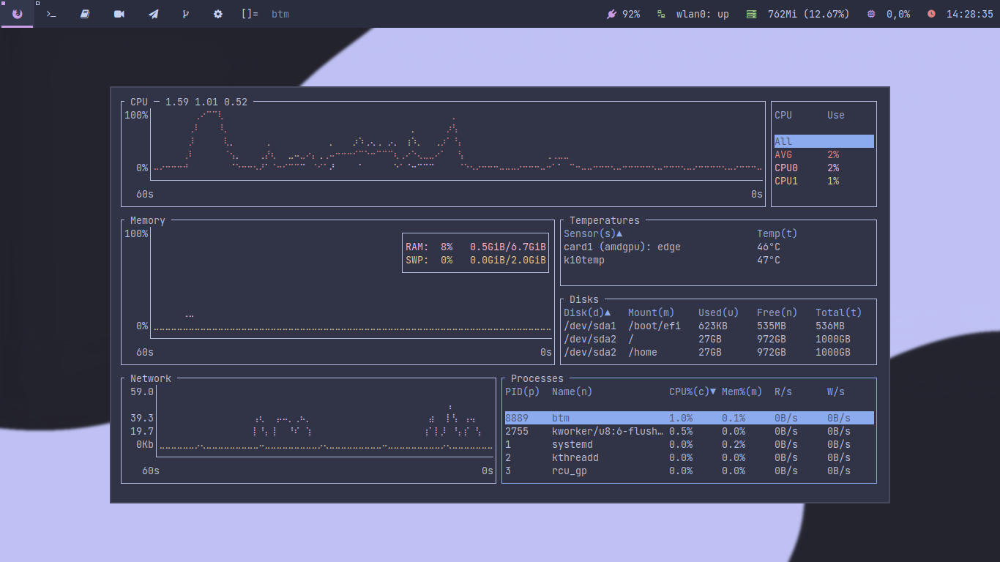
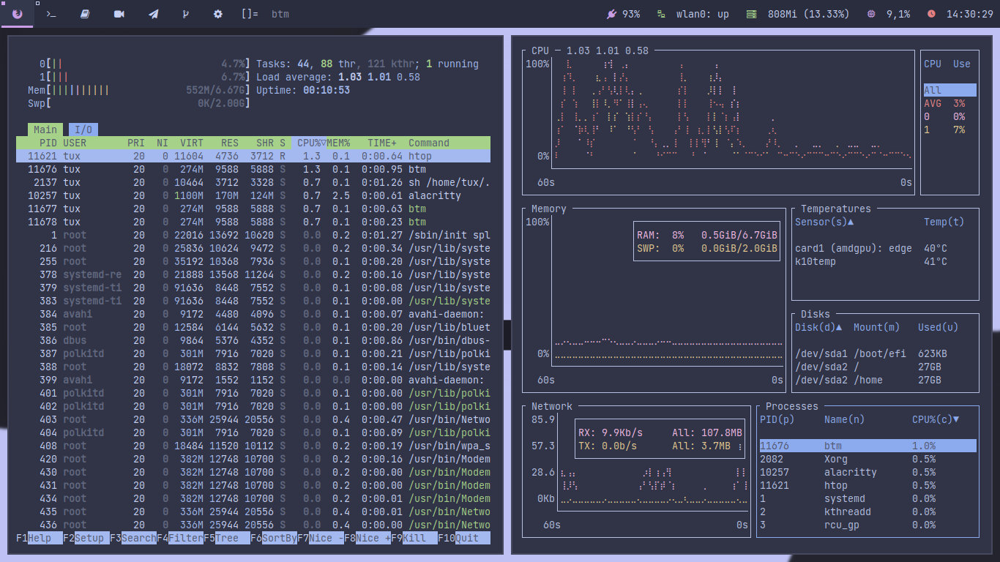

 
  

<h1>
  
  
</h1>
 

En este repositorio encontraras mi rice para <a href="https://dwm.suckless.org/">dwm</a>, con sus configuraciones y guias para poder instalarlos en tu computer y probarlo. 

> **Note:**
> Has de tener en cuenta que algunos ajustes como el tamano de la barra, las lineas de underline de los tags, las fuentes y demas esta adaptado para mi resolucion de pantalla. Por ello, seguramente tengas que hacer algunos cabios a la configuracion.

**Dependencias**
- <a href="https://archlinux.org/packages/core/x86_64/make/">make</a>
- <a href="https://wiki.archlinux.org/title/python">python</a>
- <a href="https://wiki.archlinux.org/title/feh">feh</a>

