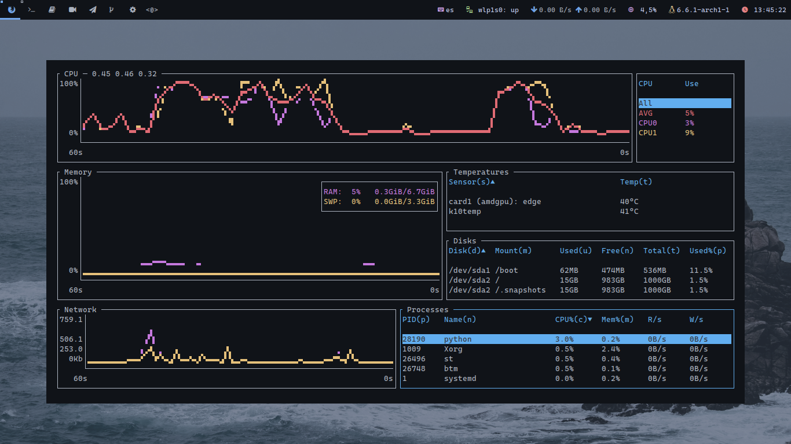

<div align="center"> 
  
</div>
<br> 



<h1>
  <a href="#--------">
    
  </a>
  <a href="#--------">
    
  </a>
</h1>
<br>

In this repository you will find my rice for <a href="https://dwm.suckless.org/">dwm</a>, with its configuration files and guide to install it in your computer and test it. 

> **Note:**
> You have to take into account that some settings like the size of the bar, the underline lines of the tags, the fonts and others are adapted to my screen resolution. Therefore, you will probably have to make some adjustments to the configuration.

**Dependencias**
- <a href="https://archlinux.org/packages/core/x86_64/make/">make</a>
- <a href="https://wiki.archlinux.org/title/python">python</a>
- <a href="https://wiki.archlinux.org/title/feh">feh</a>
- <a href="https://man.archlinux.org/man/route.8.en">route</a>
- <a href="https://archlinux.org/packages/extra/x86_64/python-psutil/">psutil</a>

**Applied Patches**

Status Bar |  | 
--- | --- |
<a href="https://dwm.suckless.org/patches/rainbowtags/">Rainbowtags</a> | Allows each tag to be an independent/unique color when selected |
<a href="https://dwm.suckless.org/patches/statuspadding/">Statuspadding</a> | Makes horizontal and vertical padding in the status bar configurable |
<a href="https://dwm.suckless.org/patches/status2d/">Status2d</a> | Allows colors and rectangle drawing in the status bar |
<a href="https://dwm.suckless.org/patches/notitle/">Notitle</a> | Doesn't show the title of the selected window at the status bar |

Layouts | |
--- | --- |
<a href="https://dwm.suckless.org/patches/fibonacci/">Fibonacci</a> | Arranges all windows in Fibonacci tiles |

Windows | |
--- | --- |
<a href="https://dwm.suckless.org/patches/vanitygaps/">Vanity gaps</a> | Adds gaps between windows |
<a href="https://github.com/FT-Labs/pdwm/blob/master/patches/dwm-6.3-patches/dwm-preserveonrestart-6.3.diff">Preserveonrestart</a> |  Doesnt let all windows mix up into tag 1 after restarting dwm |
<a href="#">Follow window (selfmade)</a> | Lets you configure the decision to follow a window when you move it to another workspace |

General | |
--- | --- |
<a href="">Easy rate (selfmade)</a> | Lets you configure the refresh rate of dwm (based on <a href="https://dwm.suckless.org/patches/refreshrate/">refreshrate</a> ) |

## Install
The `install.sh` file makes it easy for you to install my dwm configuration. This script has several possible arguments that can vary according to your needs. So I advise you to clone the repository and use the `-h` flag as a script parameter to see the options:

```bash
git clone https://github.com/dpv927/dwm.git && cd dwm
./install -h
```

> **Note:**
> The directory destination for my script is ~/.config/dwm. 

## Be sure

If you have used an `-i` flag when running the installation script, my has not been compiled and installed on the system. In case you are not sure, simply run the following make command:

```bash
cd ~/.config/dwm
sudo make clean install
```

## Want a desktop entry?

Now you may want to create a new entry in Xsessions to be able to access dwm via a login display manager like sddm, lightdm. To do this, create a new file in the path */usr/share/xsessions/dwm.desktop*:

```bash
[Desktop Entry]
Name=dwm
Comment=A beutiful dwm rice
Exec=/home/user/.config/dwm/scripts/run.sh
Type=Application 
```
