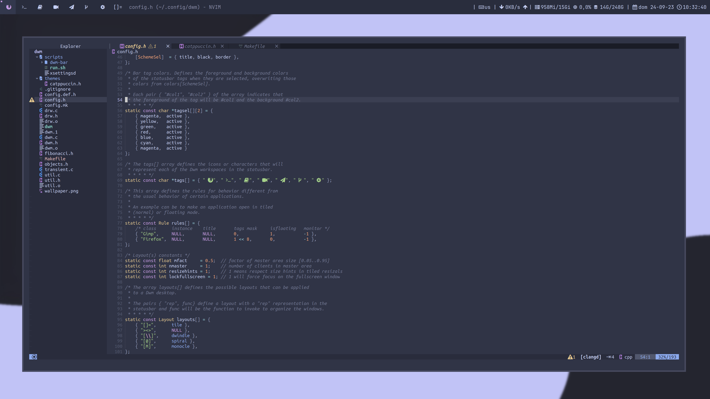

# Tiling window managers

En este repositorio encontraras diferentes rices de algunos window managers, como <a href="https://dwm.suckless.org/">dwm</a>, <a href="https://xmonad.org/">xmonad</a>... con sus configuraciones y guias parapoder instalarlos en tu computer y probarlos.

> **Note:**
> Las configuraciones estan disenadas para una pantalla 3840x2160, asi que tendras que cambiar algunos ajustes para que todo funcione properly.

## DWM

